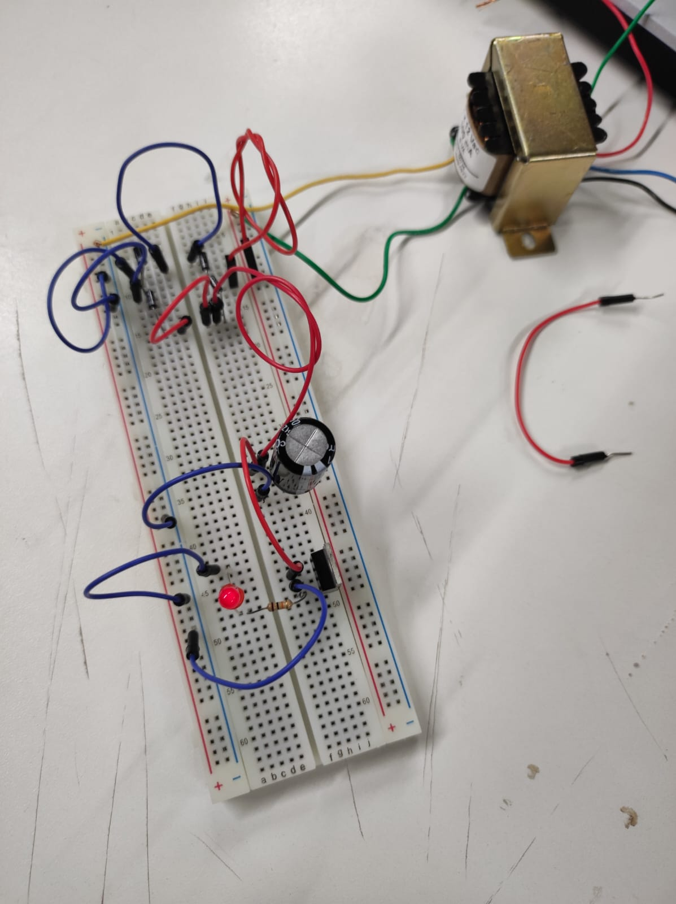
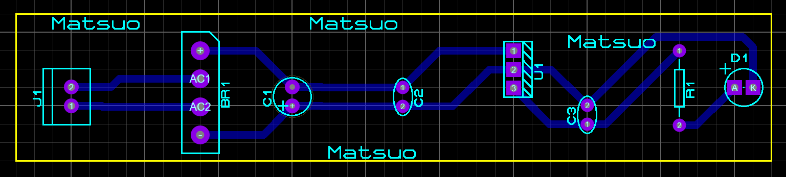
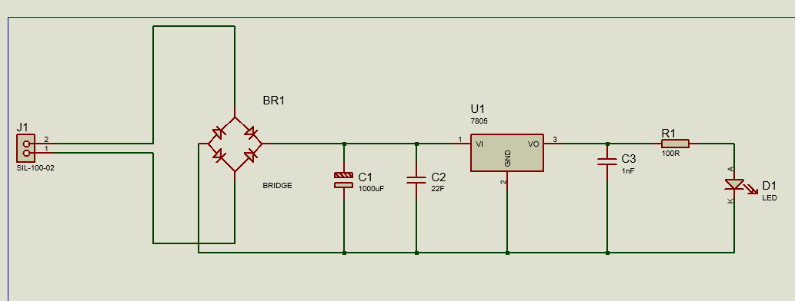
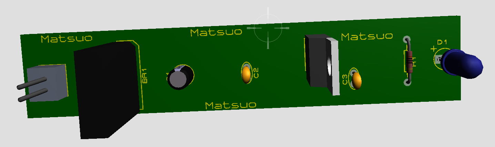

# SistemasEmbarcados

Este repositório contém informações e recursos relacionados ao projeto de um transformador para carregador de celular, incluindo detalhes sobre o funcionamento, prototipagem e imagens do PCB desenvolvido no software Proteus.

## Funcionamento

O transformador converte a corrente alternada (AC) da rede elétrica em corrente contínua (DC) para carregar o celular. O retificador é uma parte essencial desse processo, usando diodos para permitir que a corrente flua em uma direção, transformando a AC em DC.

### Tipos de Retificadores
- **Meia Onda:** Usa um diodo para permitir apenas metade da onda AC, resultando em uma corrente intermitente.
- **Onda Completa:** Utiliza quatro diodos em uma ponte retificadora para aproveitar toda a onda AC, resultando em uma corrente mais constante.

## Prototipagem

O protótipo envolveu o uso de uma protoboard, transformador de 127V para 12V, 4 diodos, 1 LED, 1 resistor e 1 capacitor. Aqui está uma imagem do protótipo:

## Imagens do PCB

